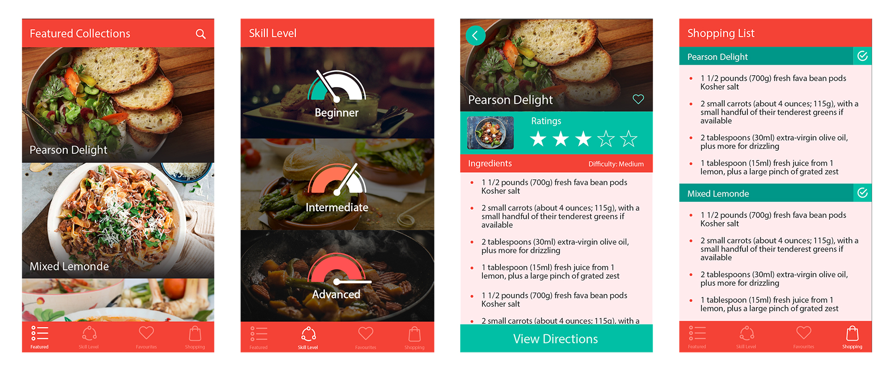

## Homemade

An iOS app that allows users to find recipe recommendations, filter by skill level, keep track of favourites, and add recipe ingredients to a personal shopping list. Featured recipes are collected using the Frugal Feeds API and are dynamically stored in an SQLite database when favourited by users.

### Built With

* [Swift 3](https://developer.apple.com/swift/)
* [Xcode 8](https://developer.apple.com/xcode/)

### Authors

* Joshua Jon
* Jackson Lloyd
